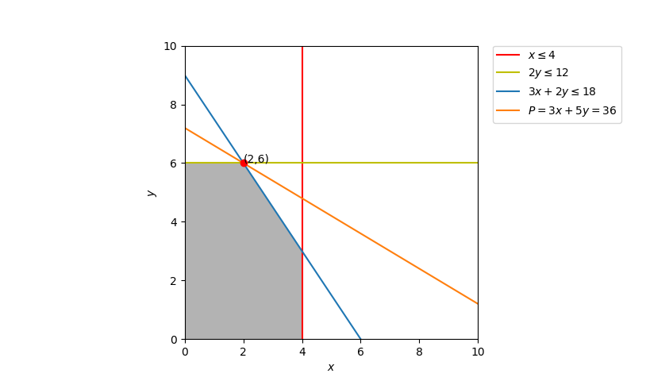

# Linear Programming

- Simple and powerful
- Address a general management problem
    - Allocate **limited resources** among **competing activities** in an **optimal** way

## Terminology

[Linear Programming]
- Formulation
    - Decision variables
    - Objective function
    - Constraints
- Variables 
    - Non-basic variables : Decision variables (x, y, x_1, x_n, etc)
    - Basic variable : slack variables (s_1, s_2, etc)
- Standard form
    - Objective function to be maximized
    - All constraints are inequalities with a "<=" sign
    - Non-negative variables

[Matrix]
- Row operation 
    - Swapping two rows,
    - Multiplying a row by a nonzero number,
    - Adding a multiple of one row to another row.

## Example

### Background 

- A manufacturer produce 2 product
    - product 1 : use material 1 and 3
    - product 2 : use material 2 and 3
- It owns 3 plants
    - A : material 1
    - B : material 2
    - C : material 3


|                  | Production time per patch (hrs) |           | Production time available (hrs) |
| ---------------- | ------------------------------- | --------- | ------------------------------- |
|                  | Product 1                       | Product 2 |                                 |
| Plant 1          | 1                               | 0         | 4                               |
| Plant 2          | 0                               | 2         | 12                              |
| Plant 3          | 3                               | 2         | 18                              |
| Profit per batch | $3,000                          | $5,000    |                                 |

### Formulation

- Decision variables
    - x : # of batches of Product 1
    - y : # of batches of Product 2
- Objective function
    - Max P = {3x + 5y}
- Constraints
    - Production time
        -     x <= 4  (Plant 1)
        -     2y <= 12 (Plant 2)
        -     3x+2y <= 18 (Plant 3)
    - Nonnegativity
        -     x >= 0
        -     y >= 0

### Graphical Solution




### Simplex algorithm

#### Idea 

- Feasible solution of a linear programming problem can be represented as a n-dimentional simplex(Polytope)
- Optimal solution(s) appear in one or more of the vertex in the simplex
- Starting with any one of the solution(vertex), walking along a path on the edges of the simplex to vertices with non-decreasing values of the objective function until an optimum is reached.


#### Execution

> See simplex-algo.py

- Convert problem into standard form.
- Construct initial tableau


```
Max 
    3x + 5y

s.t. 
    x       <= 4 
    2y      <= 12
    3x+2y   <= 18
    x,y     >= 0
```

1) Adding slack variable to change inequalities to equalities and construct initial tableau
```
Max 
    P - 3x - 5y + 0a + 0b + 0c = 0
s.t. 
    x     + a = 4 
    2y    + b = 12
    3x+2y + c = 18

    x,y,a,b,c >= 0

```
| x   | y   | a   | b   | c   | P   | value | R   |
| :-- | :-- | :-- | :-- | :-- | --- | :---- | :-- |
| 1   | 0   | 1   | 0   | 0   | 0   | 4     | R_1 |
| 0   | 2   | 0   | 1   | 0   | 0   | 12    | R_2 |
| 3   | 2   | 0   | 0   | 1   | 0   | 18    | R_3 |
| -3  | -5  | 0   | 0   | 0   | 1   | 0     | R_4 |

2) Find the pivot column by choosing the most negative value in objective function

| x   | [y]   | a   | b   | c   | P   | value | R   |
| :-- | :-- | :-- | :-- | :-- | --- | :---- | :-- |
| 1   | [0]   | 1   | 0   | 0   | 0   | 4     | R_1 |
| 0   | [2]   | 0   | 1   | 0   | 0   | 12    | R_2 |
| 3   | [2]   | 0   | 0   | 1   | 0   | 18    | R_3 |
| -3  | [-5]  | 0   | 0   | 0   | 1   | 0     | R_4 |

3) Find the pivot row by calcualting theta (value/pivot col) and choose the row with smallest theta

| x   | [y]  | a   | b   | c   | P   | value | R   | theta     |
| :-- | :--- | :-- | :-- | :-- | --- | :---- | :-- | --------- |
| 1   | [0]  | 1   | 0   | 0   | 0   | 4     | R_1 | 4/0 = inf |
| [0] | [2]  | [0] | [1] | [0] | [0] | [12]  | R_2 | 12/2=6    |
| 3   | [2]  | 0   | 0   | 1   | 0   | 18    | R_3 | 18/2=9    |
| -3  | [-5] | 0   | 0   | 0   | 1   | 0     | R_4 |           |

4) Make every row excep pivot row in pivot column "0" by performing operations

R_2 -> R_2 / pivot_element

| x   | [y]  | a   | b     | c   | P   | value | R   | theta |
| :-- | :--- | :-- | :---- | :-- | --- | :---- | :-- | ----- |
| 1   | [0]  | 1   | 0     | 0   | 0   | 4     | R_1 |       |
| [0] | [1]  | [0] | [1/2] | [0] | [0] | [6]   | R_2 |       |
| 3   | [2]  | 0   | 0     | 1   | 0   | 18    | R_3 |       |
| -3  | [-5] | 0   | 0     | 0   | 1   | 0     | R_4 |       |

R_3 -> R_3 - 2*R_2

| x   | [y]   | a   | b     | c   | P   | value | R   | theta |
| :-- | :---- | :-- | :---- | :-- | --- | :---- | :-- | ----- |
| 1   | [0]   | 1   | 0     | 0   | 0   | 4     | R_1 |       |
| [0] | [1]   | [0] | [1/2] | [0] | [0] | [6]   | R_2 |       |
| (3) | ([0]) | (0) | (-1)  | (1) | (0) | (6)   | R_3 |       |
| -3  | [-5]  | 0   | 0     | 0   | 1   | 0     | R_4 |       |

R_4 -> R_4 + 5*R_2

| x    | [y]   | a   | b     | c   | P   | value | R   | theta |
| :--- | :---- | :-- | :---- | :-- | --- | :---- | :-- | ----- |
| 1    | [0]   | 1   | 0     | 0   | 0   | 4     | R_1 |       |
| [0]  | [1]   | [0] | [1/2] | [0] | [0] | [6]   | R_2 |       |
| 3    | [0]   | 0   | -1    | 1   | 0   | 6     | R_3 |       |
| (-3) | ([0]) | (0) | (5/2) | (0) | (1) | (30)  | R_4 |       |

5) Repeat step (2) to (4) untill all non-basic variables (x and y) become non-negative.

Pivot column : x

| [x]  | y   | a   | b   | c   | P   | value | R   | theta |
| :--- | :-- | :-- | :-- | :-- | --- | :---- | :-- | ----- |
| [1]  | 0   | 1   | 0   | 0   | 0   | 4     | R_1 |       |
| [0]  | 1   | 0   | 1/2 | 0   | 0   | 6     | R_2 |       |
| [3]  | 0   | 0   | -1  | 1   | 0   | 6     | R_3 |       |
| [-3] | 0   | 0   | 5/2 | 0   | 1   | 30    | R_4 |       |

Pivot Row : R_3

| [x]  | y   | a   | b    | c   | P   | value | R   | theta   |
| :--- | :-- | :-- | :--- | :-- | --- | :---- | :-- | ------- |
| [1]  | 0   | 1   | 0    | 0   | 0   | 4     | R_1 | 4/1=4   |
| [0]  | 1   | 0   | 1/2  | 0   | 0   | 6     | R_2 | 6/0=inf |
| [3]  | [0] | [0] | [-1] | [1] | [0] | [6]   | R_3 | 6/3=2   |
| [-3] | 0   | 0   | 5/2  | 0   | 1   | 30    | R_4 |         |

R_3 -> R_3/3

| [x]  | y   | a   | b      | c     | P   | value | R   | theta |
| :--- | :-- | :-- | :----- | :---- | --- | :---- | :-- | ----- |
| [1]  | 0   | 1   | 0      | 0     | 0   | 4     | R_1 |       |
| [0]  | 1   | 0   | 1/2    | 0     | 0   | 6     | R_2 |       |
| [1]  | [0] | [0] | [-1/3] | [1/3] | [0] | [2]   | R_3 |       |
| [-3] | 0   | 0   | 5/2    | 0     | 1   | 30    | R_4 |       |

R_1 -> R_1 - R_3

| [x]   | y   | a   | b      | c      | P   | value | R   | theta |
| :---- | :-- | :-- | :----- | :----- | --- | :---- | :-- | ----- |
| ([0]) | (0) | (1) | (1/3)  | (-1/3) | (0) | (2)   | R_1 |       |
| [0]   | 1   | 0   | 1/2    | 0      | 0   | 6     | R_2 |       |
| [1]   | [0] | [0] | [-1/3] | [1/3]  | [0] | [2]   | R_3 |       |
| [-3]  | 0   | 0   | 5/2    | 0      | 1   | 30    | R_4 |       |

R_4 -> R_4 + 3*R_3

| [x]   | y   | a   | b      | c     | P   | value | R   | theta |
| :---- | :-- | :-- | :----- | :---- | --- | :---- | :-- | ----- |
| [0]   | 0   | 1   | 1/3    | -1/3  | 0   | 2     | R_1 |       |
| [0]   | 1   | 0   | 1/2    | 0     | 0   | 6     | R_2 |       |
| [1]   | [0] | [0] | [-1/3] | [1/3] | [0] | [2]   | R_3 |       |
| ([0]) | (0) | (0) | (3/2)  | (1)   | (1) | (36)  | R_4 |       |

6) Obtain result with final tableau, ignoring slack variables

| x   | y   | P   | value | R   |
| :-- | :-- | :-- | :---- | :-- |
| 0   | 1   | 0   | 6     | R_2 |
| 1   | 0   | 0   | 2     | R_3 |
| 0   | 0   | 1   | 36    | R_4 |

P is maximiseed at 36 when x=2 and y=6